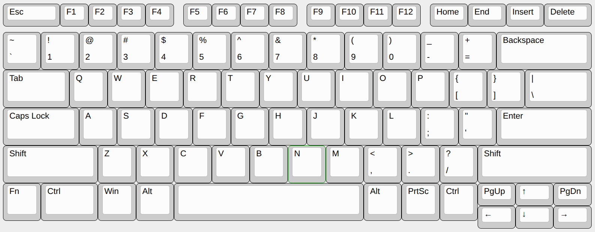

# My Keyboard Config
*part of my [dotfiles](https://github.com/allisnulll/dotfiles)*

I decided to learn the **[Graphite](https://github.com/rdavison/graphite-layout)** layout, so this is the **[Kanata](https://github.com/jtroo/kanata)** config I ended up creating. Looking at the [configuration guide](https://jtroo.github.io/config.html#multi) I realized there was a lot more I could do than just change the positions of the letters, so I added the following:

## Features
- Home Row Mods
- Navigation, Numrow, Numpad, Symbol, and Function layers
- One-shot shift keys
- Repeat keys *(never press the same key twice in a row)*
- Caps-word key
- Swappable base layers for toggling features on and off
- Access to `hjkl;'` or `yhaei;` keys with Vim layer
- Custom Nav layer for video speed controller browser extension

## **Vanilla Thinkpad T480s Keyboard:**


*(Swapped Fn and Ctrl in the BIOS)*

```
    esc  f1  f2  f3  f4  f5  f6  f7  f8  f9  f10  f11  f12 home end  ins  del
    grv  1    2    3    4    5    6    7    8    9    0    -    =         bspc
    tab       q    w    e    r    t    y    u    i    o    p    [    ]    \
    caps      a    s    d    f    g    h    j    k    l    ;    '         ent
    lsft      z    x    c    v    b    n    m    ,    .    /              rsft
    lctl wkup lmet lalt           spc            ralt prnt rctl pgup up   pgdn
                                                                left down rght
```
This is the base keyboard layout I am working with. All the layers are designed for the layout of the ***ThinkPad t480s*** laptop. The **Kanata** key names can be found [here](https://github.com/jtroo/kanata/blob/main/parser/src/keys/mod.rs).

## Base Layers:
There are six possible base layers:
- *graphite*
- *qwerty*
- *graphite-no-home-row*
- *qwerty-no-home-row*
- *graphite-home-row*
- *qwerty-home-row*

These are all combinations of different letter layouts as well as varying amounts of custom keys. The goal of this is to improve the ability to keep your fingers on the home row, while still retaining all the regular functionality the regular keyboard layout provides.

### **Graphite**
```
    _    _   _   _   _   _   _   _   _   _   _    _    _   @hmr @lyt @rst _
    @~   _    _    _    _    _    _    _    _    _    _    _    _         _
    _         b    l    d    w    z    '    f    o    u    j    _    _    _
    _         n    r    t    s    g    y    h    a    e    i    ;         _
    _         q    x    m    c    v    k    p    _    _    _              _
    _    _    _    _              _              _    _    rmet _    _    _
                                                                _    _    _
```
This is what I change from the vanilla layer to get the **Graphite** layout. I like to keep the symbols the same as in **Qwerty**.

The top-right keys are responsible for base layer switching:
- *hmr:*
    * **Double-tap** = Toggle between *graphite-home-row* & *graphite* or *qwerty-home-row* & *qwerty*
    * **Shift + Double-tap** = Enter *graphite-no-home-row* or *qwerty-no-home-row*
- *lyt:*
    * **Double-tap** = Toggle between *graphite-home-row* & *qwerty-home-row* or *graphite* & *qwerty* or *graphite-no-home-row* & *qwerty-no-home-row*
- *rst:*
    * **Double-tap** = Reload Kanata, useful for debugging config file.

I also added a couple minor changes:
- Swapped `` ` `` and `~`
- Remapped *rctl* to *rmet*

### **Special Keys**
```
    _    _   _   _   _   _   _   _   _   _   _    _    _   @hmr @lyt @rst _
    @~   _    _    _    _    _    _    _    _    _    _    _    _         _
    _         _    _    _    _    _    _    _    _    _    _    _    _    _
    @md1      _    _    _    _    _    _    _    _    _    _    @md2      @md3
    @lsf      _    _    _    _    _    _    _    _    _    _              @rsf
    _    _    _    @md4           _              @md5 _    rmet _    _    _
                                                                _    _    _
```
This is what I change from the vanilla layer to get all of the features besides home row mods.
- *md1:*
    * **Tap** = escape key
    * **Hold** = [nav layer](#Navigation)
    * **Double-tap** = [custom nav layer](#Custom-Navigation-Layer)
    * **Shift + tap** = *[cw](#Navigation)*
- *md2:*
    * **Tap** = regular key
    * **Hold** = [numrow layer](#Numrow)
    * **Double-tap** = [numpad layer](#Numpad)
- *md3:*
    * **Tap** = repeat key
    * **Hold** = [function layer](#Function)
- *md4:*
    * **Tap** = repeat key
    * **Hold** = [vim layer](#Vim)
- *md5:*
    * **Tap** = enter key
    * **Hold** = [nav layer](#Navigation)
- *lsf & rsf:*
    * **Tap** = One-shot shift
    * **Hold** = [sym layer](#Symbol)

### **Home Row**
```
    _    _   _   _   _   _   _   _   _   _   _    _    _   @hmr @lyt @rst _
    @~   _    _    _    _    _    _    _    _    _    _    _    _         _
    _         _    _    _    _    _    _    _    _    _    _    _    _    _
    @md1      @hr1 @hr2 @hr3 @hr4 _    _    @hr5 @hr6 @hr7 @hr8 @md2      @md3
    @lsf      _    _    _    _    _    _    _    _    _    _              @rsf
    _    _    _    @md4           _              @md5 _    rmet _    _    _
                                                                _    _    _
```
Finally, the layout is completed with the inclusion of home row mods. I am using **[GASC](https://precondition.github.io/home-row-mods#gasc)** home row mods which means the order is *Meta*, *Alt*, *Shift*, and then *Ctrl*.
- *hr1-8:*
    * **Tap** = regular key
    * **Hold** = modifier key
    * **Double-tap** = regular key *(useful for regular hold key behavior when desired)*

## Sub Layers:
A lot of layers only change one side of the keyboard allowing the other hand to hold down any desired modifiers while still inside them. This makes it look like layers which take up both sides of the keyboard cannot be combined with modifiers, this is not the case.

> ***Important:*** To achieve the same effect, simply hold down modifiers before entering the layer.

This combination of home row mods and layers are what truly turn this layout from requiring fingers to move to keys, to requiring fingers to press keys already moved to them.

### **Navigation**
```
    caps nlck slck _   _   _   _   _   _   _   _   _   _   _    _    _    _
    @cw  _    home up   end  _    _    _    _    brdn brup vold volu      mute
    @tb1      ent  left down rght _    mwl  mwd  mwu  mwr  _    prev next pp
    _         tab  ins  pgup pgdn _    _    _    _    _    _    _         _
    _         _    _    _    _    _    _    _    _    _    _              _
    _    _    _    del            bspc           _    menu _    _    _    _
                                                                _    _    _
```
Provides easy access to navigation keys, as well as other useful keys. Does not remove access to modifier keys on right side in order to allow for things like highlight or jump by word. *(Arrow keys are where they are to avoid keyboard ghosting)*
- *cw:* Caps-word key to capitalize the next typed word.
- *tb1:* **Ctrl+Tab** for easy access when changing tabs in web browser. *(tb2 in [custom nav layer](#Custom-Navigation-Layer))*
- Access to useful keys like enter and tab, as well as backspace and delete.
- Access to media keys as well as brightness keys
- Access to some minorly useful mouse keys as well as the regular lock keys just in case.

### **Numrow**
```
    _    _    _    _   _   _   _   _   _   _   _   _   _   _    _    _    _
    _    _    _    _    _    _    _    _    _    _    _    _    _         _
    _         _    _    _    _    _    _    _    _    _    _    _    _    _
    _         1    2    3    4    5    6    7    8    9    0    _         _
    _         _    _    _    _    _    _    _    _    _    _              _
    _    _    _    _              _              _    _    _    _    _    _
                                                                _    _    _
```
Moves the numbers at the top of the keyboard down to your fingers, so you don't have to reach for them. This makes a lot of shortcuts more convenient, especially ones for switching windows or tabs, making this one of the most useful layers.

### **Numpad**
```
    _    _    _    _   _   _   _   _   _   _   _   _   _   _    _    _    _
    _    @ch8 @ch4 @ch2 @ch1 _    _    _    @ch8 @ch4 @ch2 @ch1 _         _
    _         _    _    _    _    _    =    kp7  kp8  kp9  @+   _    _    _
    _         _    _    _    _    _    kp0  kp4  kp5  kp6  @*   _         _
    _         _    _    _    _    _    @.   kp1  kp2  kp3  @^             _
    _    _    _    _              _              _    _    _    _    _    _
                                                                _    _    _
```
Customized numpad, mostly used to access +, *, and ^ keys.
- `+` shifts to `-`
- `*` shifts to `/`
- `^` shifts to `%`
- `.` shifts to `,`
- *ch1-8:* Random binary chord config I found in Kanata docs that I never use but I think is cool.

### **Symbol**
```
    _    _    _    _   _   _   _   _   _   _   _   _   _   _    _    _    _
    _    _    _    _    _    _    _    _    _    _    _    _    _         _
    _         _    _    @~   @&   @!   @#   @|   grv  _    _    _    _    _
    _         @<   [    @{   @op  -    @_   @cp  @}   ]    @>   _         _
    _         =    _    _    \    @@   @$   @%   _    _    =              _
    _    _    _    _              _              _    _    _    _    _    _
                                                                _    _    _
```
Symbol layer with access to all the bracket types by finger.
- *op:* Opening parenthesis
- *cp:* Closing parenthesis

### **Function**
```
    _    _    _    _   _   _   _   _   _   _   _   _   _   _    _    _    _
    _    _    _    _    _    _    _    _    _    _    _    _    _         _
    _         @f12 @f7  @f8  @f9  _    _    _    _    _    _    _    _    _
    _         @f11 @f4  @f5  @f6  _    _    _    _    _    _    _         _
    _         @f10 @f1  @f2  @f3  _    _    _    _    _    _              _
    _    _    _    _              _              _    _    _    _    _    _
                                                                _    _    _
```
Function layer with easy access to F11 *(fullscreen toggle)* and F13-24 while using shift.

### **Vim**
```
    _    _    _    _   _   _   _   _   _   _   _   _   _   _    _    _    _
    _    _    _    _    _    _    _    _    _    _    _    _    _         _
    _         _    _    _    _    _    _    _    _    _    _    _    _    _
    _         _    _    _    _    _    @lft @dwn @up  @rgt @;   @'        _
    _         _    _    _    _    _    _    _    _    _    _              _
    _    _    _    _              _              _    _    _    _    _    _
                                                                _    _    _
```
A mask into the opposite layout for those six keys on the right side of the keyboard commonly used for **Vim Motions**. This removes a major downsides to using alternate keyboard layouts.
- If *graphite* then `hjkl;'`
- If *qwerty* then `yhaei;`

### **Custom Navigation Layer**
*(for using Video Speed Controller Chrome extension)*
```
    _    _    _    _   _   _   _   _   _   _   _   _   _   _    _    _    _
    _    _    _    _    _    _    _    _    _    _    _    _    _         _
    @tb2      q    w    e    r    _    _    _    _    _    _    _    _    _
    _         a    s    d    f    g    _    _    _    _    _    _         _
    _         _    _    _    v    b    _    _    _    _    _              _
    _    _    _    _              _              _    _    _    _    _    _
                                                                _    _    _
```
This is what I use when watching YouTube while using **Graphite** layout.  
`f` key is used for fullscreen.


## External Config
- *kanata.service* makes it so you don't have to manually launch **Kanata** every system start.
    * On **Hyprland** add this line to reliably start the service on startup:
    ```Hyprlang
    exec-once = systemctl --user start kanata.service
    ```
- Whenever the layout is switched a script is run that changes the directional keymaps for my *Hyprland*, *Tmux*, and *Rofi* configs.
    * The idea behind the script is to have a patch file generated beforehand using `git diff` that is then applied by the script.
    * Script file can be found [here](https://github.com/allisnulll/dotfiles/blob/main/scripts/graphite2qwerty.sh).
    * Patch file can be found [here](https://github.com/allisnulll/dotfiles/blob/main/patches/graphite2qwerty.patch).
- *kanata.service* makes it so you don't have to manually launch **Kanata** every system start. *(Stopped working)*
```zsh
# Kanata
alias kn="kanata -c ~/kanata/kanata.kbd --log-layer-changes"
alias knd="kanata -dc ~/kanata/kanata.kbd --log-layer-changes"
alias kns="systemctl --user stop kanata"
alias knl="systemctl --user status kanata"
alias knr="systemctl --user daemon-reload && systemctl --user restart kanata"
```
- *zippy.txt* has chords for frequently used text. I never use this tbh, but mine looks something like this:
```txt
us 1	Username1
us 2	Username2
em e	email1@mail.com
em e 2	email2@mail.com
fi h	/home/username/
fi d w	/home/username/Downloads/
fi d c	/home/username/Documents/
fi d e	/home/username/Desktop/
fi p	/home/username/Pictures/
fi v	/home/username/Videos/
fi .	/home/username/.dotfiles/
fi m	/home/username/Music/
```

### Useful Keybind Examples:
- *Nav layer provides easy access to useful shortcuts for navigation such as*
    * **Chromium Browser:**
        + **Ctrl+PgUp *or* Ctrl+PgDn:** Jump to next or previous tab
            1. Hold `j` for ctrl
            2. Hold `CapsLock` to enter Nav
            3. Press `f` or `t` for PgUp or PgDn
        + **Ctrl+Shift+PgUp *or* Ctrl+Shift+PgDn:** Move tab left or right
            1. Hold `j` for ctrl
            2. Hold `k` for shift
            3. Hold `CapsLock` to enter Nav
            4. Press `f` or `t` for PgUp or PgDn
        + **Alt+Left Alt+Right:** previous or next page
            1. Hold `l` for alt
            2. Hold `CapsLock` to enter Nav
            3. Press `w` or `r` to go between pages
        + **Ctrl+{number}:** Jump to specific tab
            1. Hold `f` or `j` for ctrl
            2. Hold `;` to enter Numrow
            3. Press any middle row key in order to jump to the corresponding numbered tab
